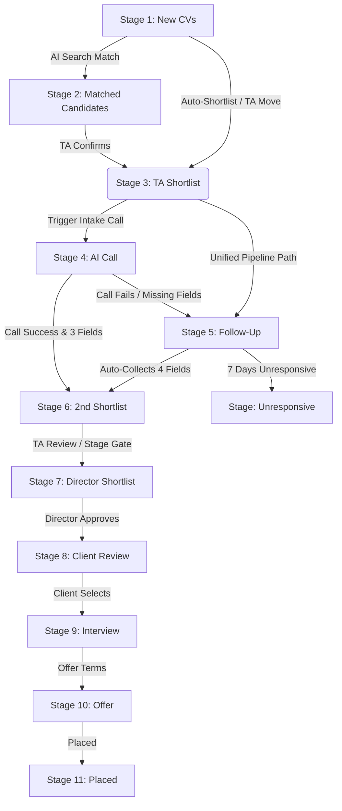

# Career141 Recruitment Pipeline and AI Matching System Architecture

This document provides a comprehensive overview of the backend functions, pipeline stages, candidate search, and reverse matching mechanisms running in the Career141 system. 

---

## 1. System Overview & Technology Stack

Career141 is an AI-driven recruitment pipeline system built on:
- **Database & Serverless Backend**: [Convex](https://www.convex.dev/) (defined in the [convex/](file:///c:/Users/hdbin/Documents/Projects/cv-processing-recruitment-pipeline-system/convex) directory).
- **Frontend App**: Next.js (located in the [src/](file:///c:/Users/hdbin/Documents/Projects/cv-processing-recruitment-pipeline-system/src) directory).
- **AI Voice Screening (Agent 5)**: [ElevenLabs Conversational AI API](file:///c:/Users/hdbin/Documents/Projects/cv-processing-recruitment-pipeline-system/convex/integrations/elevenlabs.ts) paired with Twilio for outbound phone calls.
- **Inbound & Outbound WhatsApp Bridge**: Built using `@whiskeysockets/baileys` (defined in [whatsapp-bridge.js](file:///c:/Users/hdbin/Documents/Projects/cv-processing-recruitment-pipeline-system/whatsapp-bridge.js)) and WhatChimp API.
- **Email Ingestion & Outreach (Agent 7)**: Microsoft Graph API integrations.
- **AI Models & Embeddings**: NVIDIA NIM API (Llama 3.1 70B for extraction/chat, Nemotron-70B for query parsing, and `nv-embedqa-e5-v5` for vector indexing).

---

## 2. Core Data Models

The system schema is defined in [convex/schema.ts](file:///c:/Users/hdbin/Documents/Projects/cv-processing-recruitment-pipeline-system/convex/schema.ts). The primary tables supporting the pipeline and candidate matching are:

### `candidates`
Stores the candidate's global profile.
- **Key Fields**: `fullName`, `email`, `phone`, `location`, `linkedinUrl`, `currentJobTitle`, `currentEmployer`, `totalExperienceYears`, `skills` (array), `jobHistory`, `noticePeriodDays`, `expectedSalary`, `currentSalary`, `embedding` (vector format: 1024 dimensions), `rawText`, `isParsed`, `doNotContact`.
- **Indexes**: Indexed by `email`, `phone`, `fullName`, `fileHash`, `overallStatus`, `linkedinUrl`, plus a vector index `vector_index_candidates` for semantic similarity.

### `cvUploads`
Tracks uploaded CV files and their processing status.
- **Key Fields**: `storageId` (refers to Convex native storage), `fileName`, `fileSize`, `fileType`, `fileHash` (SHA-256), `source`, `assignToJob` (jobId reference), `status` (`pending`, `processing`, `processed`, `failed`), `candidateId`.

### `applications`
Acts as a join table linking a candidate to a specific job and tracks their individual stage progress.
- **Key Fields**: `candidateId`, `jobId`, `cvFileId`, `sourceChannel`, `currentStage`, `aiMatchScore`, `aiMatchExplanation`, `stageHistory`, `followUpCvReceived`, `followUpCurrentSalary`, `followUpExpectedSalary`, `followUpNoticePeriod` (completion flags for Agent 3), `followUpEnteredAt`.
- **Indexes**: Indexed by `[jobId, currentStage]`, `[candidateId, jobId]`, and `[jobId, aiMatchScore]`.

### `jobs`
Maintains job requirements and AI/pipeline configuration.
- **Key Fields**: `title`, `clientName`, `jobDescription`, `requiredSkills`, `niceToHaveSkills`, `experienceMinYears`, `seniorityLevel`, `location`, `keyword` (unique routing code), `status` (`active`, `on_hold`, `filled`, `cancelled`, `draft`), `reverseMatchResults`, `scoreWeightSkills` (etc.), `minMatchScoreToShow`, `agent3Enabled`, `agent5Enabled`.

### `communications`
Logs inbound and outbound messages.
- **Key Fields**: `candidateId`, `applicationId`, `jobId`, `direction` (`inbound`, `outbound`), `channel` (`email`, `whatsapp`, `sms`), `body`, `deliveryStatus` (`pending`, `sent`, `delivered`, `read`, `failed`).

### `aiCalls`
Tracks Twilio and ElevenLabs automated call instances.
- **Key Fields**: `candidateId`, `applicationId`, `jobId`, `callStatus` (`scheduled`, `in_progress`, `completed`, `no_answer`, `failed`), `ivrResponse`, `recordingUrl`, `transcript`, `attempts`.

---

## 3. The Recruitment Pipeline Stage-by-Stage

The system supports an 11-stage pipeline defined under the `currentStage` field of the `applications` table. The backend logic is managed in [convex/pipeline/stages.ts](file:///c:/Users/hdbin/Documents/Projects/cv-processing-recruitment-pipeline-system/convex/pipeline/stages.ts) and [convex/pipeline/followUpHelper.ts](file:///c:/Users/hdbin/Documents/Projects/cv-processing-recruitment-pipeline-system/convex/pipeline/followUpHelper.ts).



### Stage 1: New CVs (`new_cvs`)
- **What happens**: The entry point for all parsed CVs. Candidates are queued here upon file upload.
- **Functions**: [processCvIngestion](file:///c:/Users/hdbin/Documents/Projects/cv-processing-recruitment-pipeline-system/convex/pipeline/ingestion.ts#L6) verifies job status and SHA-256 duplication, saves to `cvUploads`, and triggers `processCvExtraction` action.
- **Transitions**: Candidates automatically move to `ta_shortlist` if their AI match score meets the job’s `minMatchScoreToShow` threshold (configured in [saveMatchScore](file:///c:/Users/hdbin/Documents/Projects/cv-processing-recruitment-pipeline-system/convex/cvs/cvScoringActions.ts#L25)).

### Stage 2: Matched Candidates (`matched_candidates`)
- **What happens**: A staging area for candidates discovered through active database semantic/keyword searches.
- **Functions**: [bulkAddToPipeline](file:///c:/Users/hdbin/Documents/Projects/cv-processing-recruitment-pipeline-system/convex/matching/search.ts#L276) pushes search hits into this stage. TA recruiters must manually review and shortlist them.

### Stage 3: TA Shortlist (`ta_shortlist` / `shortlisted`)
- **What happens**: Recruiter has confirmed interest in the candidate.
- **Functions**: [moveToTAShortlist](file:///c:/Users/hdbin/Documents/Projects/cv-processing-recruitment-pipeline-system/convex/pipeline/stages.ts#L9) mutations handle this.
- **Pipeline Progression**: To unify the screening flow, moving a candidate to TA Shortlist immediately routes them into the **Follow-Up** stage (`follow_up`) to begin missing profile data collection.

### Stage 4: AI Call (`ai_call`)
- **What happens**: The automated voice screening stage. An ElevenLabs outbound intake call is scheduled.
- **Functions**: [triggerIntakeCall](file:///c:/Users/hdbin/Documents/Projects/cv-processing-recruitment-pipeline-system/convex/integrations/elevenlabs.ts#L7) handles communication with the ElevenLabs API, sending dynamic candidate/job variables.
- **Outcomes**: 
  - If Twilio receives a "Declined" keypress (digit 2), the application is rejected.
  - If the call is answered and all 3 data points (current salary, expected salary, notice period) are successfully collected by the AI agent, the candidate bypasses Follow-Up and goes straight to **2nd Shortlist**.
  - If the call is unanswered, fails, or partial data is collected, the application moves to **Follow-Up**.

### Stage 5: Follow-Up (`follow_up`)
- **What happens**: Automatic profiling data collection stage. The system requires four items: **CV, Current Salary, Expected Salary, and Notice Period**.
- **Functions**: Managed by [initiateFollowUpOutreach](file:///c:/Users/hdbin/Documents/Projects/cv-processing-recruitment-pipeline-system/convex/pipeline/followUpHelper.ts#L117) and [evaluateFollowUpStage](file:///c:/Users/hdbin/Documents/Projects/cv-processing-recruitment-pipeline-system/convex/crons.ts#L8).
- **Outbox Outreach**: Schedules an outbound WhatsApp (via WhatChimp) and Microsoft Graph Email sequence specifying the exact missing fields.
- **Hourly Cron Sweep**:
  - Automatically advances the candidate to **2nd Shortlist** if all four flags (`followUpCvReceived`, `followUpCurrentSalary`, etc.) become true.
  - Detects if the candidate replied. If they did, it halts further automated outreach, logging the reply platform (`whatsapp`, `email`, or `phone`).
  - Schedules Day 0, Day 4, and Day 6 follow-up messages if the candidate remains silent.
  - If the candidate remains unresponsive after 7 days, they are auto-moved to the **Unresponsive** stage.

### Stage 6: 2nd Shortlist (`second_shortlist`)
- **What happens**: Profile completed stage. A candidate can only reside here if all 4 required follow-up fields are present.
- **Functions**: Checked by [setPipelineStage](file:///c:/Users/hdbin/Documents/Projects/cv-processing-recruitment-pipeline-system/convex/pipeline/stages.ts#L122). Trying to force a candidate here without these fields throws an validation error.

### Stage 7: Director Shortlist (`director_shortlist` / `director_review`)
- **What happens**: Internal executive sign-off stage.
- **Functions**: [directorApprove](file:///c:/Users/hdbin/Documents/Projects/cv-processing-recruitment-pipeline-system/convex/pipeline/stages.ts#L65) moves them to Client Review; [directorReject](file:///c:/Users/hdbin/Documents/Projects/cv-processing-recruitment-pipeline-system/convex/pipeline/stages.ts#L164) marks them as rejected; [directorRequestChanges](file:///c:/Users/hdbin/Documents/Projects/cv-processing-recruitment-pipeline-system/convex/pipeline/stages.ts#L208) rolls them back to `ta_shortlist` with feedback.

### Stage 8: Client Review (`client_review`)
- **What happens**: Candidate is presented to the client contact for review.
- **Functions**: Clients can approve to Interview ([clientApprove](file:///c:/Users/hdbin/Documents/Projects/cv-processing-recruitment-pipeline-system/convex/pipeline/stages.ts#L248)), mark as Hold ([clientHold](file:///c:/Users/hdbin/Documents/Projects/cv-processing-recruitment-pipeline-system/convex/pipeline/stages.ts#L276)), or reject ([clientReject](file:///c:/Users/hdbin/Documents/Projects/cv-processing-recruitment-pipeline-system/convex/pipeline/stages.ts#L303)).

### Stage 9: Interview (`interview`)
- **What happens**: Coordination and logging of client interviews.
- **Functions**: Supported by mutations under [convex/pipeline/stages.ts](file:///c:/Users/hdbin/Documents/Projects/cv-processing-recruitment-pipeline-system/convex/pipeline/stages.ts).

### Stage 10: Offer (`offer`)
- **What happens**: Offer terms, startDate, and salary are logged.

### Stage 11: Placed (`placed`)
- **What happens**: The placement is finalized. The candidate is marked as placed, updating their global profile status.

### Special Stage: Unresponsive (`unresponsive`)
- **What happens**: Candidates who did not complete follow-up requirements within the 7-day window. Recruiters can manually contact them from here. If a candidate provides their details later, the cron reopened their application to **2nd Shortlist** instantly.

### Special Stage: Rejected (`rejected`)
- **What happens**: Candidate was rejected at any point, with the reason and rejection stage logged.

---

## 4. CV Ingestion & Processing Flow

The core backend ingestion and parsing logic is found in [convex/pipeline/ingestion.ts](file:///c:/Users/hdbin/Documents/Projects/cv-processing-recruitment-pipeline-system/convex/pipeline/ingestion.ts) and [convex/cvs/cvExtraction.ts](file:///c:/Users/hdbin/Documents/Projects/cv-processing-recruitment-pipeline-system/convex/cvs/cvExtraction.ts).

```
[Inbound Source] 
(WhatsApp bridge, email, portal) 
       │
       ▼
[processCvIngestion] ──(Check SHA-256 duplicate)──> [cvUploads (pending)]
       │
       ▼
[processCvExtraction] (Action)
       │
       ├──> Extract Raw Text (PDF.js / Mammoth / Tesseract OCR)
       ├──> Clean Raw Text (Headers, Footers, Page Numbers)
       ├──> Nvidia NIM Embedding (generate 1024-dim Vector)
       ├──> Nvidia Llama 3.1 70B AI (Extract structured JSON)
       ├──> Standardize & Derive Fields (Experience, Seniority, Salary)
       │
       ▼
[createCandidate] (Mutation) ──(4-Factor Deduplication Check)
       │
       ├──> [Candidate Exists?]
       │         ├──> YES (In Follow-up / Auto-rejected) ──> Update profile, check follow-up flags
       │         ├──> YES (In other stage) ──> Skip updating to preserve active progress
       │         └──> NO ──> Create New Candidate
       ▼
[createApplication] ──> Set stage to "new_cvs"
       │
       ▼
[processCvScoring] (Action) ──(Blend Heuristics [60%] & LLM [40%])
       │
       └──> Score >= minMatchScoreToShow? ──> YES ──> Auto-advance to "ta_shortlist"
```

### Inbound Media Sources
1. **WhatsApp Webhooks**: Webhooks forward documents/images.
   - Meta Cloud API sends payloads to `/api/whatsapp`, which runs [handleMetaWhatsappWebhook](file:///c:/Users/hdbin/Documents/Projects/cv-processing-recruitment-pipeline-system/convex/communications/metaWhatsappAgent.ts#L33).
   - WhatsApp Local Bridge (running Baileys) listens on the phone, downloads media, and forwards it to `/api/local-whatsapp-inbound` which runs [handleLocalWhatsappWebhook](file:///c:/Users/hdbin/Documents/Projects/cv-processing-recruitment-pipeline-system/convex/communications/localWhatsappAgent.ts#L5).
   - Handles **two-tap forwarding extraction**: extracts the candidate's phone number from message context `message.context?.from` when a TA forwards a CV.
2. **Microsoft Graph Webhook**: Change notifications hit `/api/graph-webhook` when emails land in the TA inbox. This schedules [readInboxMessages](file:///c:/Users/hdbin/Documents/Projects/cv-processing-recruitment-pipeline-system/convex/communications/graphEmail.ts) to read the email, detect CV attachments, and queue them.

---

## 5. Candidate Deduplication Engine (Agent 6)

Implemented during candidate profile creation/patching in the [createCandidate](file:///c:/Users/hdbin/Documents/Projects/cv-processing-recruitment-pipeline-system/convex/candidates/candidates.ts#L144) mutation, the deduplication engine applies a **4-Factor match filter**:

1. **File Hash match**: Searches `candidates` table by `fileHash`.
2. **Email match**: Searches `candidates` table by `email`.
3. **Phone match**: Searches `candidates` table by `phone`.
4. **LinkedIn URL match**: Searches `candidates` table by `linkedinUrl`.

### Merging and Profile Overwrite Rules
- If an existing candidate is found:
  - If the candidate has active applications in stages *other than* `follow_up` or the 7-day auto-rejected state, **overwriting is skipped**. This prevents a new CV upload from altering a candidate's profile while they are undergoing active client review or interviews.
  - If the candidate is in `follow_up` or has been auto-rejected for missing details, the profile fields are updated with the newly extracted data. The system then updates the follow-up completion flags (`followUpCvReceived`, etc.) and runs `checkAndAdvanceFollowUp` to see if they can advance.
- If no candidate exists, a new candidate document is inserted.

---

## 6. How Candidate Search Works

The search functionality supports natural language query understanding, keyword matching, and vector matching. The logic resides in [convex/matching/search.ts](file:///c:/Users/hdbin/Documents/Projects/cv-processing-recruitment-pipeline-system/convex/matching/search.ts) and [convex/cvs/cvScoring.ts](file:///c:/Users/hdbin/Documents/Projects/cv-processing-recruitment-pipeline-system/convex/cvs/cvScoring.ts).

### Combined AI & Heuristic Search Workflow (`aiSearch` action)
1. **Query Interpretation**: Uses NVIDIA NIM Llama 3.1 instruct to analyze the user's natural language query and extract structured search requirements (`SearchRequirements`), identifying requested titles, skills, location, industry, seniority, and experience.
2. **Vector Similarity Search**: Generates an embedding of the query using the NVIDIA NIM API. If successful, it queries the `candidates` table vector index `vector_index_candidates` to retrieve the top 100 candidates based on cosine similarity.
3. **Multi-Term Keyword Search**: Performs parallel full-text search queries (via `searchCandidates` query) using:
   - The original search query
   - Extracted job titles
   - Required skills
   - Extracted search keywords
   This runs against the Convex full-text indexes (`search_text`, `search_title`, and `search_summary`), assigning match weights (Title match = 100, Text match = 50, Summary match = 30).
4. **Deduplication & Heuristics Scoring**: Merges the vector and keyword search pools and deduplicates candidates. It scores the top 30 candidates heuristically against the extracted requirements:
   - **Title Score**: Cleans seniority words, compares job titles against candidate titles (exact, substring, or token overlap).
   - **Seniority Score**: Rates seniority level matching (Intern, Junior, Mid, Senior, Lead, Executive).
   - **Experience Score**: Subtracts points for gaps between target and actual years.
   - **Skills Score**: Matches candidate skills to required/nice-to-have skills (using normalization and synonyms mapping).
   - **Location Score & Industry Score**: Checks token overlaps.
5. **LLM Re-Scoring**: Selects a pool of the top 15-20 candidates and calls the NIM Llama-3.1 model to score their fit directly (0-100).
6. **Blending & Sorting**: Blends the LLM score with the heuristics and vector scores, filters out low scores, and returns the sorted shortlist.

---

## 7. How Reverse Matching Works

Reverse matching automatically scans the candidate database against a job description when it is published or manually rescanned. The active code is defined in [runReverseMatch](file:///c:/Users/hdbin/Documents/Projects/cv-processing-recruitment-pipeline-system/convex/matching/agent2.ts#L105).

```
       [Job Published / Rescan Triggered]
                      │
                      ▼
       [Generate Job embedding if missing]
                      │
                      ▼
         ┌────────────┴────────────┐
         ▼                         ▼
  [Keyword Search]          [Vector Search]
  Search by Job title       Search candidates
  and required skills       vector index by Job
  (parallel batches)        embedding (top 150)
         │                         │
         └────────────┬────────────┘
                      ▼
     [Generate missing candidate embeddings]
                      │
                      ▼
     [Calculate Cosine Similarity scores]
                      │
                      ▼
  [Compute Heuristic scores using Job weights]
     Job title, Skills, Experience, Industry, Location
                      │
                      ▼
     [STRICT FILTER: 0 missing required skills
      AND overall score >= minMatchScoreToShow]
                      │
                      ▼
  [Sort by overall score and save top 30 results]
```

### Step-by-Step Execution
1. **Job Embedding Generation**: If the job has no embedding, a formatted string containing the Title, Description, Skills, Industry, and Seniority is embedded via NVIDIA NIM and saved to the job.
2. **Parallel Keyword Search**: Extract terms (Job title and first 4 required skills) and query `searchCandidates` in parallel to gather candidate hits.
3. **Vector Database Scan**: Query the Convex vector index using the Job embedding to retrieve the top 150 candidates.
4. **On-the-fly Embedding Sync**: To guarantee vector precision, the system identifies any keyword-matched candidates that are missing embeddings. It generates and stores their embeddings on the fly (up to 15 per run).
5. **Cosine Similarity and Enriching**: Merge all candidates from both keyword and vector searches. For keyword-matched candidates that fell outside the top vector search results, the system manually computes their cosine similarity against the job embedding.
6. **Job-Weighted Heuristic Scoring**: Scores each candidate against the requirements, multiplying the sub-scores by the job-specific weights:
   $$\text{MatchScore} = \text{TitleScore} \times W_{\text{title}} + \text{SkillScore} \times W_{\text{skills}} + \text{ExperienceScore} \times W_{\text{exp}} + \text{IndustryScore} \times W_{\text{industry}} + \text{LocationScore} \times W_{\text{location}}$$
7. **Strict Qualification Gate**: Applies a filter ensuring **0 missing required skills** (`missingSkills.length === 0`) and `overallScore >= minMatchScoreToShow`.
8. ** shortlisting**: Saves the top 30 sorted candidates into the job's `reverseMatchResults` array.

---

## 8. Summary of Webhook Callbacks & Automated Intake

Managed in [convex/http.ts](file:///c:/Users/hdbin/Documents/Projects/cv-processing-recruitment-pipeline-system/convex/http.ts):

1. **`/api/elevenlabs/save-intake`**: Executes when the ElevenLabs voice agent collects candidate details mid-call. Updates the candidate's global profile (`currentSalary`, `expectedSalary`, `noticePeriodDays`) and flips application progress flags.
2. **`/api/elevenlabs/post-call-webhook`**: Triggers when the phone call ends. 
   - If call status is completed and all fields were captured, it moves the application to `second_shortlist` immediately.
   - If any fields are missing, it moves the candidate to `follow_up` and starts the 7-day clock.
   - If the call was unanswered or failed, it routes them to `follow_up`.
3. **`/api/twilio-callback`**: Receives IVR keypress details. If the candidate presses 1 (Interested), they auto-advance to `second_shortlist`. If they press 2 (Declined), the application is rejected.
